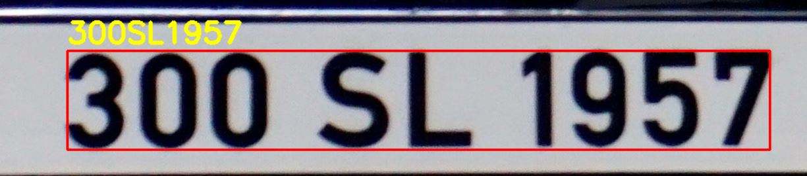

# License-plate Detection by YOLO

This repositery has a method to detect number of licence plate. It use a yolo-licence-plate detection method to detect number plate. Then crop Region of interest from the image.
Then detect Text in the image using pytesseract





## How to employ?

You can download the weight file from [this](https://drive.google.com/file/d/1vXjIoRWY0aIpYfhj3TnPUGdmJoHnWaOc/ "this") link.

###Step to follow
run index.py
can change image in index.py to test for another image
```

## Citation

Please cite us as below formation:
1. S. Khazaee, A. Tourani, S. Soroori, A. Shahbahrami, and C. Y. Suen, “**A Real-time License-Plate Detection Method using a Deep Learning Approach**,” 2nd International Conference on Pattern Recognition and Artificial Intelligence, Zhongshan, 2020. ([link](https://users.encs.concordia.ca/~icprai20/ "link"))

## Collaborators

- [Sajjad Soroori](https://github.com/SajjadSo "Sajjad Soroori")
- [Ali Tourani](https://github.com/alitourani "Ali Tourani")
